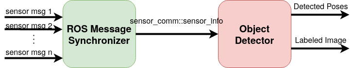
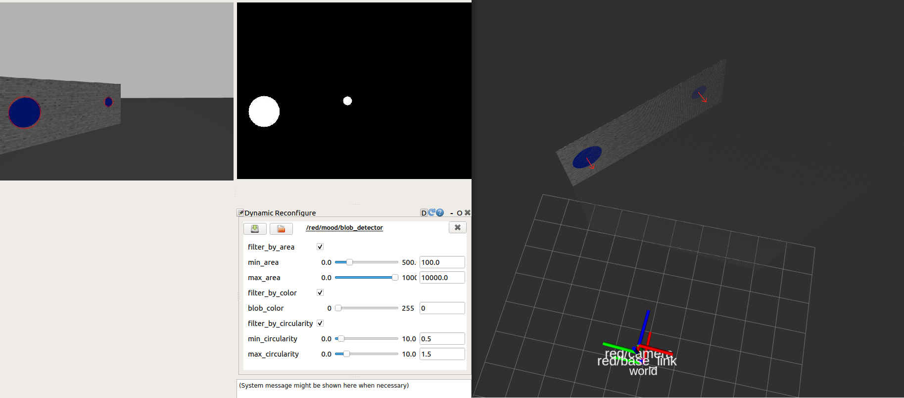

# Modular Object Detection Framework

## Introduction

The *MOOD* Framework is used for easier integration of object detection algorithms
using the [ROS plugin](http://wiki.ros.org/pluginlib/Tutorials/Writing%20and%20Using%20a%20Simple%20Plugin) libraries.

## Dependencies

### ROS Packages
* [uav_ros_lib](https://github.com/lmark1/uav_ros_lib)
* [pcl_ros](http://wiki.ros.org/pcl_ros)

### External packages
* OpenCV
* PCL
* Intel Realsense
    * ```sudo apt install ros-$ROS_DISTRO-realsense2-camera ros-$ROS_DISTRO-rgbd-launch```
    * [Setup /etc/udev/rules.d](https://github.com/IntelRealSense/realsense-ros/issues/1408#issuecomment-698128999)

## Description
The *MOOD* manager consists of a ROS Message Synchronizer plugin and an Object Detector plugin.
<p float="left">
    
</p>

### ROS Message Synchronizer
In order to synchronize the needed sensor messages please provide a ROS message synchonization
implementation of the ```mood_base::msg_sync_interface``` in [msg_sync_interface.hpp](include/mood_ros/msg_sync_interface.hpp).  
**NOTE** If there is need for synchronization of more than three ROS messages or other ROS message types, please augment the ```sensor_comm::sensor_info``` structure in [sensor_comm.hpp](include/mood_ros/sensor_comm.hpp).

### Object Detector
In order to add a new object detector plugin please provide a concrete implementation of the ```mood_base::detector_interface``` in  [detector_interface.hpp](include/mood_ros/detector_interface.hpp).

### Pose Tracker and Kalman Filter
For now remain static elements of the MOOD Manager. Pose Tracker tracks a single detected pose based on distance and Kalman filter performs prediction on the given tracked pose.

### MOOD Manager
A node which dynamically loads and connects one ROS Message Synchronizer plugin and one Object Detector plugin defined by the given configuration file (e.g. [detection_manager_config.yaml](config/detection_manager_config.yaml)).  
**NOTE** Plugins do not need to be sctrictly in the *mood_ros* ROS package. Any plugin that implements the appropriate interface can be
loaded into the MOOD Manager node.

## Blob Detector Example

An example detector plugin which aims to detect Blob poses using RGB-D sensor information. It expects to be paired with a  synchronization plugin that can provide ```sensor_msgs::Image``` and ```sensor_msgs::Pointcloud2``` ROS messages (e.g. [PointcloudRGBSync](src/double_msg_sync.cpp)).

<p float="left">
    
</p>

## FAQ

### What are ROS Plugins?

[Here](https://www.xuningyang.com/2020-05-12-ros-pluginlib/) is a quick tutorial on making and using ROS plugins. 