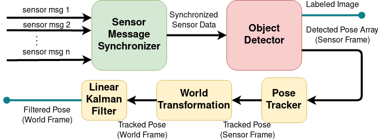

# Modular Object Detection Framework

## Introduction

The *MOOD* Framework is used for easier integration of object detection algorithms
using the [ROS plugin](http://wiki.ros.org/pluginlib/Tutorials/Writing%20and%20Using%20a%20Simple%20Plugin) libraries.

## Dependencies

### ROS Packages
* [uav_ros_lib](https://github.com/lmark1/uav_ros_lib)
* [larics_gazebo_worlds](https://github.com/larics/larics_gazebo_worlds/)
 
### External packages
* OpenCV
* PCL

## Description
The *MOOD* manager consists of a ROS Message Synchronizer plugin and an Object Detector plugin.
<p float="left">
    
</p>

### ROS Message Synchronizer
In order to synchronize the needed sensor messages please provide a ROS message synchonization
implementation of the [msg_sync_interface.hpp](include/mood_ros/msg_sync_interface.hpp) interface.  
**NOTE** If there is need for synchronization of more than three ROS messages or other ROS message types, please augment the ```sensor_comm::sensor_info``` structure in [sensor_comm.hpp](include/mood_ros/sensor_comm.hpp) header.


### Object Detector
In order to add a new object detector plugin please provide a concrete implementation of the [detector_interface.hpp](include/mood_ros/detector_interface.hpp) interface.

### MOOD Manager
A node which dynamically loads and connects one ROS Message Synchronizer plugin and one Object Detector plugin defined by the given configuration file.
## FAQ

### What are ROS Plugins?

[Here](https://www.xuningyang.com/2020-05-12-ros-pluginlib/) is a quick tutorial on making and using ROS plugins. 