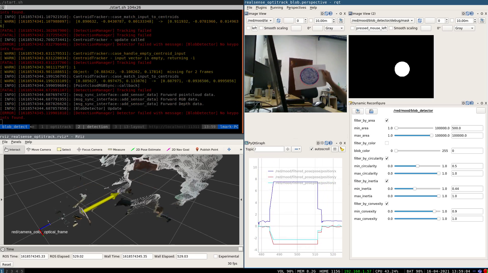

# Realsense Blob Detection in Optitrack

This startup uses a Ralsense D435 camera to perform Blob Detection. An Optitrack
system is used to validate detection results.

# Dependencies

* [librealsense](https://github.com/IntelRealSense/librealsense)
* [realsense-ros](https://github.com/IntelRealSense/realsense-ros)
* [ros_vrpn_client](https://github.com/ethz-asl/ros_vrpn_client)
* [vrpn_catkin](https://github.com/ethz-asl/vrpn_catkin)
* [catkin_simple](https://github.com/catkin/catkin_simple)
* [glog_catkin](https://github.com/ethz-asl/glog_catkin)

# Demonstration

    

